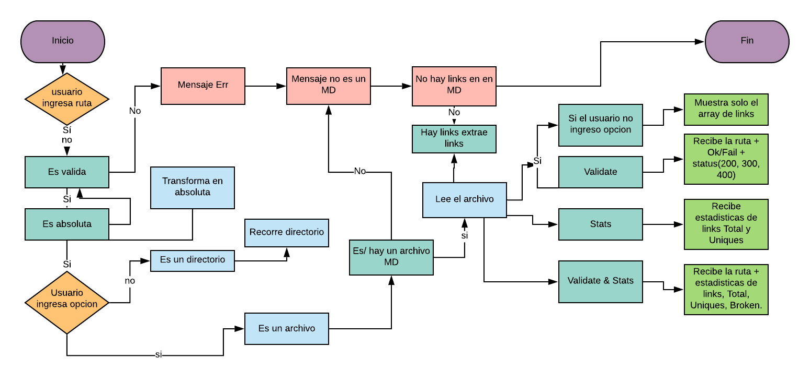

# Markdown Links

Librería que analiza archivos de tipo [Markdown](https://es.wikipedia.org/wiki/Markdown)(.md) para verificar si contiene links y entregar algunas estadísticas.

### Instalación 🔧

Para utilizar esta librería primero ...

Debes instalar el módulo con npm

```
npm install https://github.com/LujanWorld/GDL004-md-links
```

## Su uso 🎁

Este proyecto puede ser utilizado a través de la terminal CLI

Por ejemplo:

`md-links <path-to-file> [options]`
Donde options puede ser 'validate' para verificar el estado del link y/o 'stats' para ver estádisticas del archivo(path) como cantidad de links encontrados, links broken, etc

```
$ md-links README.md
 [
   {'./some/example.md: 10 - http://algo.com/2/3/ Link a algo'}
   {'./some/example.md: 15 - https://otra-cosa.net/algun-doc.html algún doc'}
   {'./some/example.md: 14 - http://google.com/ Google'}
 ]
```

Usando validate:

```
$ md-links README.md --validate
 [
   {'./some/example.md: 10 - http://algo.com/2/3/ Link a algo 200 true'}
   {'./some/example.md: 15 - https://otra-cosa.net/algun-doc.html 404 false'}
   {'./some/example.md: 14 - http://google.com/ 200 true'}
 ]
```

Usando --validate y --stats (pueden usarse tanto juntos como separados)

```
$ md-links README.md --validate --stats
 [
   {'./some/example.md: 10 - http://algo.com/2/3/ Link a algo 200 true'}
   {'./some/example.md: 15 - https://otra-cosa.net/algun-doc.html 404 false'}
   {'./some/example.md: 14 - http://google.com/ 200 true'}
   { totals: 3, success: 2, failure: 1 }
 ]
```

# Para developers

npm i

```bash
npm i
npm link .
# You can use the `md-links` cmd.
md-links -v -s test
```

# Diagrama de Flujo


